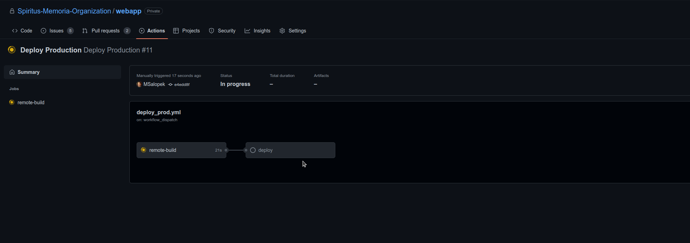

<!-- [START BADGES] -->
[](https://github.com/Spiritus-Memoria-Organization/webapp/actions/workflows/build.yml)
[](https://github.com/Spiritus-Memoria-Organization/webapp/actions/workflows/deploy_prod.yml)
<!-- [END BADGES] -->
# Spiritus Webapp

This repository contains source code, Github workflows and docker files required to run the application both locally and in various environments.

# Deploy production
Follow these steps to deploy app to production.

Production deploy is done via Github Action. You must manually trigger the workflow. Instructions are below.

### Navigate to Github Actions


### Choose Deploy Production Workflow from Workflows menu
Click on the workflow to see previous jobs.
CLicking the workflow will show you the trigger button.


### Manually trigger workflow
Click on the big green button. This will initiate the deploy.


### Check job progress
Click on the latest job entry (the one on the top). If you cannot see it, wait a couple of seconds.


### Check job progress
When the job succeeds you will have all steps marked with green.


### Job done
You should see all green.
If you don't you can check directly on the machine (via ssh) or ask somebody who deployed the app earlier.


## Local development
First, intall all dependencies for the development server:
```bash
npm install
```

Run dev server:
```bash
npm run dev
```

If you have issues setting up tailwindcss, check this page:
- https://tailwindcss.com/docs/guides/nextjs

To build an optimized version of the app run the following:

```bash
npm run build && npm run start
```

This should build the app and start it on defualt port (3000).

## Local deployment using Docker
To deploy the app on your local machine using docker you should do the following steps:
```bash
docker build -t test-app .
docker run -p 3000:3000 --env-file .env.local test-app
```

Please note that the env file must be provided, otherwise the app will not function properly.

## Local deloyment using docker compose
The app will be available on `localhost:8080`.

Build the app (to confirm build is passing):
```bash
docker compose -f ./docker-compose.local.yml build
```

Start the app:
```bash
docker compose -f ./docker-compose.local.yml up
```

`CTRL+C` will stop the app container.

You can start the service in detached mode (allows you to continue using the terminal):
```bash
docker compose -f ./docker-compose.local.yml up -d
```

Stop the app
```bash
docker compose -f ./docker-compose.local.yml stop
```

Teardown the app:
```bash
docker compose -f ./docker-compose.local.yml down
```

This will remove all associated containers and volumes.
# DateNightFrontend
